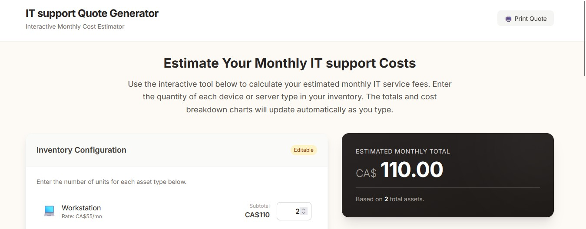

# MSA Quote Generator

A lightweight web tool that automatically calculates Managed Service Agreement (MSA) pricing based on the number and type of customer assets.  
Built to simplify the quoting process for MSPs and reduce manual work.

## Live Demo
https://ntsmk.github.io/msa-quote-generator/

## Screenshot

## Why I Built This

In my MSP work, I noticed that coworkers were manually calculating quotes based on asset counts provided by customers.  
It’s not efficient and doesn’t offer a good UI/UX experience.

I wanted a simple, user-friendly tool that:
- Calculates pricing instantly  
- Reduces errors from manual work  
- Looks clean and professional  
- Can be accessed easily by the team

So I built this browser-based MSA Quote Generator.

## Tech Stack

- HTML  
- CSS  
- JavaScript

This project doesn’t require complex AI/ML processing or a large backend system, so a simple frontend app is perfect for now.

## Deployment

Deployed on **Vercel**, chosen for its simplicity, fast deployment, and zero backend requirements for the current version.

## Future Enhancements

1. **Convert to React**  
   More sophisticated UI/UX.

2. **Login / Authentication**  
   Restrict tool access to internal staff and maintain user account–based data.

3. **Supabase Backend**  
   Store generated quotes, customers, pricing history, and asset configurations.

